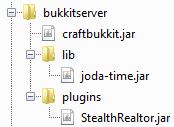

StealthRealtor - A region use plugin for Bukkit
==================

Entirely command-based system allowing your players to buy plots or rent inn rooms using WorldGuard.

**Features:**

* Put plots on the market using only the WorldGuard commands you already know - pricing and status is all stored in the standard WG flags "price" and "buyable"
* Effectively control players' ability to sell/rent their own plots using the flag and command specific permissions within WorldGuard (particularly those ending in ".own")
* Lightweight command based transactions eliminate the need for plugin-related objects (like signs) in your world and allow easy integration with scripting such as Denizen so your players don't need to actually type commands
* Powerful zoning system for local buy/rent permissions and sales tax
* Easily split up the money -- revenue gets divided among all owners of a region if there are multiple
* Maintains a "legit" economy -- money is never created or destroyed, only transferred between players

**Installation:**

For renting to work, this plugin requires the library joda-time.jar [joda-time.jar (download here)](http://downloads.sourceforge.net/project/joda-time/joda-time/2.3/joda-time-2.3-dist.zip?r=http%3A%2F%2Fsourceforge.net%2Fprojects%2Fjoda-time%2Ffiles%2Fjoda-time%2F&ts=1382227454&use_mirror=tcpdiag) to be present in Bukkit's lib folder, with that exact name. Like this:

**Documentation**

* [Commands](https://rawgithub.com/aeheathc/stealthrealtor/master/doc/commands.html)
* [Permissions](src/plugin.yml?raw=true)
* [Config file](src/config.yml?raw=true)
* [Upcoming Features](doc/todo.txt?raw=true)

Changelog
-------------------

**1.0.1**

* Tested with CB 1.7.9-R0.2
* Reworked Vault interaction since it now wants player objects instead of player name strings.

**1.0.0**

* Initial commit.